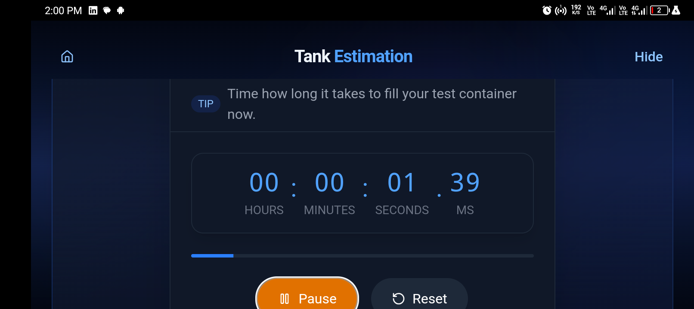

# Pump Water Management App

## Overview


The Pump Water Management App is a smart, offline application designed to help users in less advanced countries efficiently manage their water usage. Built with Tauri, React, and TypeScript in Vite, this application assists users in knowing when to pump water and how long to leave the pumps on. The app was developed as a side project within 24 hours and aims to solve the problem of water management in areas where it is handled by individuals.


> **Video Demo**
>
> Watch the video demonstration below to see the app in action:
>
> [](https://youtube.com/shorts/6q8CI5jlvms?feature=share)
>
> And to download the apk for android. Click the **Release** button on the right side of this page .


## Features

- **Calibration Process**: Calibrate your system by measuring the fill time for your tank and a container of known volume. Calibration data is stored locally, so you only need to calibrate once unless you wish to recalibrate.
- **Water Level Estimation**: Estimate the current water level in your tank based on the calibration data.
- **Smart Timers**: Use timers to record the fill time for the tank and containers.
- **Detailed Instructions**: Step-by-step guidance on how to calibrate and estimate water levels.
- **Animated Visuals**: Fluid animations and visual feedback to enhance user experience.
- **Offline Availability**: The app is completely free and works offline, with no internet required.
- **Future Features**:
  - **Predictive Pumping**: Estimate when you might need to pump water next using historical data.
  - **iOS and Desktop Builds**: Future builds for iOS and Desktop platforms.
  - **Notifications**: Add notifications to cover timer features.
  - **UI Enhancements**: Work on minor UI bugs and improvements.

## How It Works

### Calibration Process

1. **Fill Time**: Measure how long it takes to fill an empty tank completely using a stopwatch or timer.
2. **Container Test**: Measure the time required to fill a container of known volume from the full tank.
3. **Container Size**: Enter the exact volume of your test container (e.g., 5 liters or 1 gallon).
4. **Estimate**: Use the time it takes to fill the container again to estimate the tank’s current water level.

### Estimation Process

- **Tank Level Estimation**: Based on the calibration data, the app estimates the current water level in your tank using the time it takes to fill the container at any given moment.
- **Physics Calculations**: The app uses basic mathematical physics calculations to estimate the water level.
  - **Flow Rate Calculation**:
    ```math
    \text{Flow Rate} = \frac{\text{Container Volume}}{\text{Container Fill Time}} \times 60 \, \text{L/min}
    ```
  - **Tank Percentage Full**:
    ```math
    \text{Tank Percentage Full} = \min\left(\max\left(\frac{100}{\text{Fill Ratio}}, 0\right), 100\right)
    ```
  - **Estimated Time to Fill**:
    ```math
    \text{Estimated Time to Fill} = \left(\frac{\text{Remaining Percentage}}{100}\right) \times \text{Empty to Full Time}
    ```

### Ignored Variables

The app ignores certain inconsistencies and uncontrollable variables such as:

- Water usage at the time of calculation.
- Slight pressure changes.
- Water blockages.

## Installation

To build and run the app locally, follow these steps:

1. Clone the repository:

   ```bash
   git clone https://github.com/ugochukwu-850/Pump.git
   cd Pump
   ```

2. Install dependencies:

   ```bash
   npm install
   ```

3. Set up the Tauri environment:

   - Follow the [Tauri setup documentation](https://tauri.app/v1/guides/getting-started/prerequisites) to configure your environment.

4. Run the app:

   ```bash
   npm run dev
   ```

5. Build for production:
   - Follow the [Tauri build documentation](https://tauri.app/v1/guides/building) to learn how to build the project.

## Demo

Check out the demo images below to see the app in action:

| Col 1                        | Col 2                        | Col 3                        | Col 4                        |
| ---------------------------- | ---------------------------- | ---------------------------- | ---------------------------- |
|  |  |  |  |
|  |   |  |  |
|  |   |  |  |

## Contributing

We welcome contributions to improve the app. Feel free to open issues or submit pull requests on GitHub.

## License

This project is licensed under the MIT License.

## Acknowledgments

- Built with Tauri, React, and TypeScript in Vite.
- Developed as a side project within 24 hours.
- Inspired by the need for efficient water management in less advanced countries.

Ps: Shoutout to vibecoding !!! 😂😂😂
